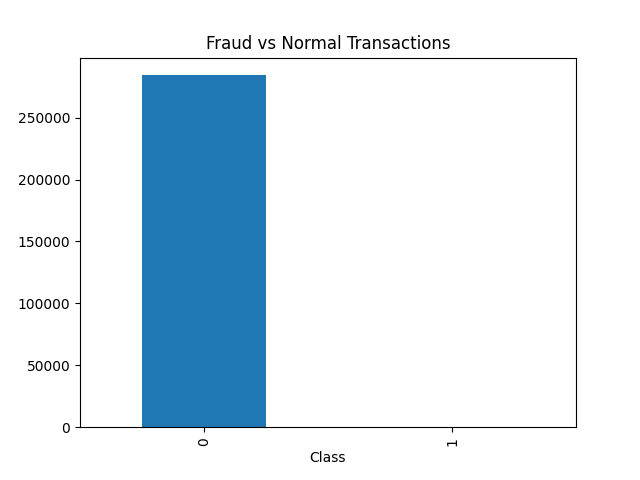
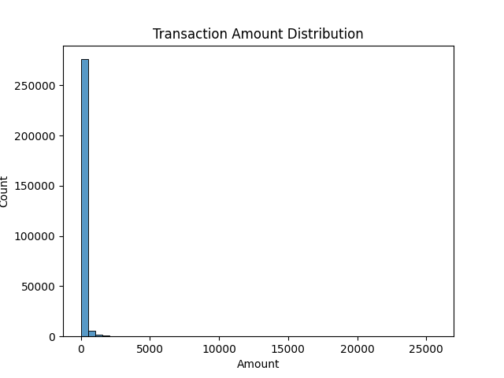
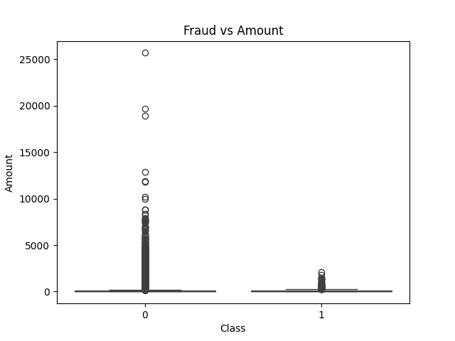
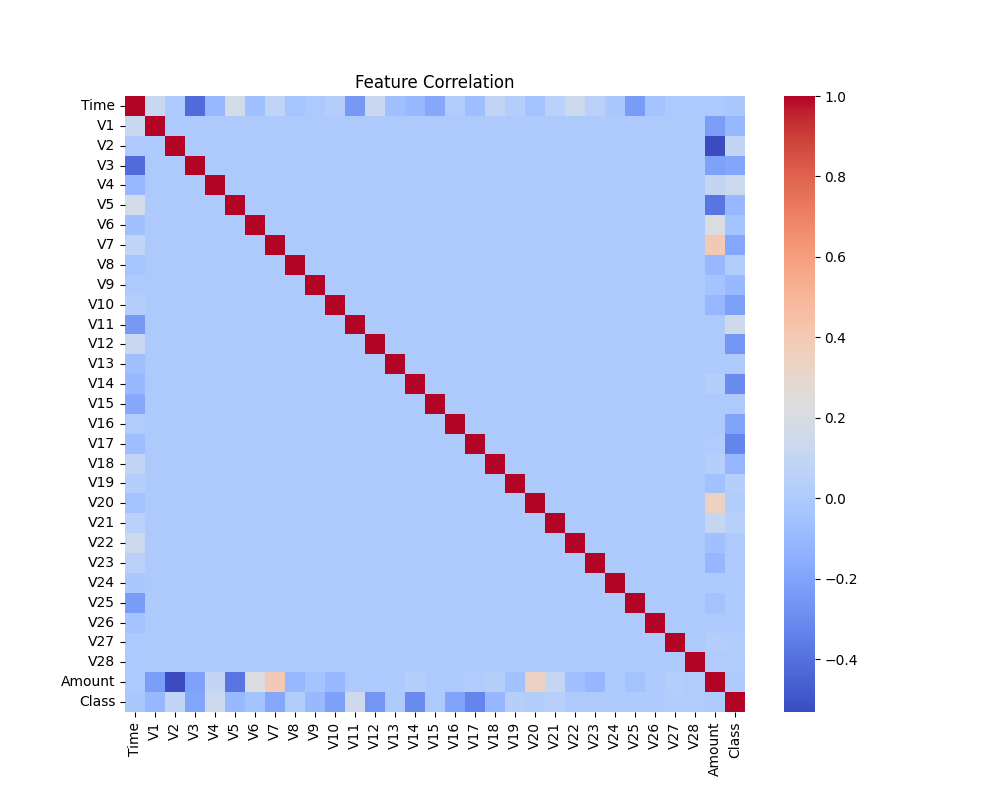

# 💳 Credit Card Fraud Detection System

## 📌 Overview

This project builds a **machine learning system** to detect fraudulent credit card transactions.
The dataset is highly imbalanced, making fraud detection a challenging and realistic problem.

The solution includes:

* Data analysis & visualization
* Handling class imbalance using SMOTE
* Model training using Random Forest
* Performance evaluation using appropriate metrics

---

## 🎯 Objective

To accurately identify fraudulent transactions while minimizing false negatives, ensuring better financial security.

---

## 📊 Dataset

* Source: Public credit card transaction dataset
* Total records: **284,807**
* Features: 30 (including anonymized features V1–V28, Time, Amount)
* Target:

  * `0` → Normal Transaction
  * `1` → Fraud Transaction

---

## ⚠️ Problem Challenge

The dataset is **highly imbalanced**:

* Normal transactions: ~284,000
* Fraud transactions: ~492

➡️ This makes **accuracy misleading**, so we focus on:

* Precision
* Recall
* F1-score
* ROC-AUC

---

## 🛠️ Tech Stack

* Python
* Pandas, NumPy
* Matplotlib, Seaborn
* Scikit-learn
* Imbalanced-learn (SMOTE)

---

## 🔍 Exploratory Data Analysis (EDA)

Key insights:

* Fraud cases are extremely rare
* Transaction amount varies significantly
* Certain features show correlation patterns

### 📈 Visualizations

#### Fraud vs Normal Transactions



#### Transaction Amount Distribution



#### Fraud vs Amount



#### Feature Correlation Heatmap



---

## ⚙️ Model Building

### 1️⃣ Data Splitting

* Train-test split: 80-20

### 2️⃣ Handling Imbalance

* Applied **SMOTE (Synthetic Minority Oversampling Technique)**
* Balanced fraud and normal classes

### 3️⃣ Model Used

* Random Forest Classifier

---

## 📊 Model Performance

* High overall accuracy
* Improved fraud detection using SMOTE

### Key Metric:

* **Recall (Fraud Detection)** → High importance
* **ROC-AUC Score** → Measures overall model quality

> The model focuses on minimizing missed fraud cases rather than just maximizing accuracy.

---

## 📁 Project Structure

```
Credit-Card-Fraud-Detection/
│
├── images/
│   ├── fraud_vs_normal.png
│   ├── amount_distribution.png
│   ├── fraud_vs_amount.png
│   └── correlation_heatmap.png
│
├── model.pkl
├── main.py
├── requirements.txt
├── README.md
```

---

## 🚀 How to Run

1. Clone the repository:

```
git clone https://github.com/your-username/Credit-Card-Fraud-Detection.git
cd Credit-Card-Fraud-Detection
```

2. Install dependencies:

```
pip install -r requirements.txt
```

3. Run the project:

```
python main.py
```

---

## 💡 Key Learnings

* Handling imbalanced datasets is critical in real-world ML problems
* Evaluation metrics must align with business goals
* SMOTE significantly improves minority class detection
* Visualization helps uncover hidden patterns

---

## 🔮 Future Improvements

* Hyperparameter tuning
* Try advanced models (XGBoost, LightGBM)
* Deploy using FastAPI
* Build a real-time fraud detection API

---

## 👩‍💻 Author

**Hemalatha**
Aspiring Data Scientist | Machine Learning Enthusiast

---

## ⭐ If you found this project useful

Give it a ⭐ on GitHub!
